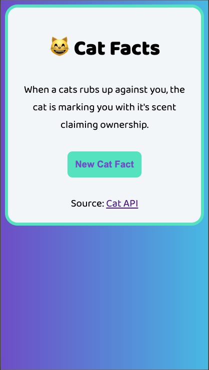
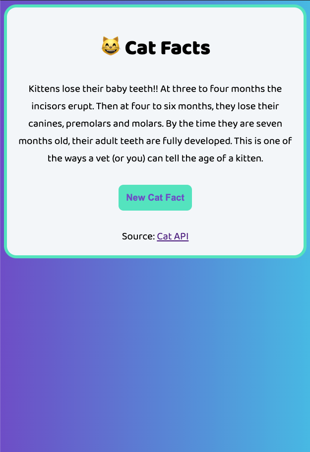

# Cat Facts Generator
**Created By:** Jessica Cassidy
A simple generator that pulls random cat facts when the application is either loaded, refreshed, or when the user clicks the button for a new fact. The facts are sourced via the cat-facts API (Application Programming Interface) created by Alex Wohlbruck (Source: [cat-facts API](https://alexwohlbruck.github.io/cat-facts/)).

## Built With:
Tailwind CSS

## Preview:
\
